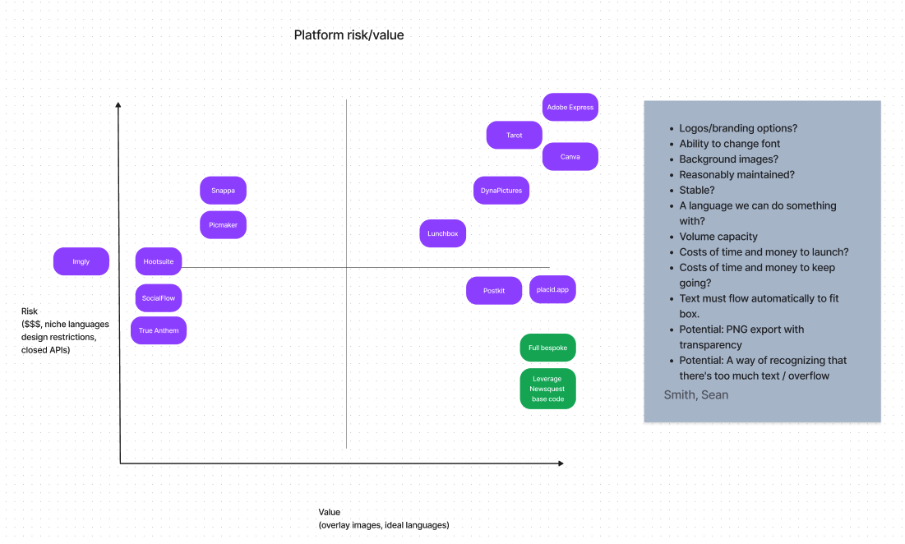

# Automating visuals with Euchre: The Why, How and What’s Next

What if you could instantly create a visual to promote a story across platforms? Or automatically extract the key facts from a story — or hundreds of stories? And effortlessly incorporate the most relevant image from a newsroom’s photo archive?

Zoom out from social media, and imagine the other possibilities for automating visuals, like creating dozens of data visualizations from one data set or crafting illustrations with just a few key words.

We explored all of these ideas and more, and decided to begin here with Euchre, pronounced you-KERR, a social card creator named after an American Midwest card game with unusual rules.

This Github repository for **Euchre** is just one building block of what could become a larger pipeline to automatically generate relevant images for news content.

Following the [ReadMe instructions](../README.md), you can download and install the program that allows you to combine a short phrase or headline from a story with a background image to make a composite image. This can be done manually via a web interface, or you may further automate with HTTP GET or POST requests.

## But first, why?

The drudgery of generic images is especially rampant in real estate coverage, which is a beat where both our media companies are also experimenting with AI-generated texts.

When [Gannett](https://www.gannett.com/) and [McClatchy](https://www.mcclatchy.com/), two leading local media organizations based in the U.S., first came together nearly 6 months ago at the start of the [2022 JournalismAI Fellowship Programme](https://www.lse.ac.uk/media-and-communications/polis/JournalismAI/Fellowship-Programme), the why was clear: **We needed a better solution for generating relevant and compelling images for stories that are difficult to illustrate.** 

Across our industry, reports about home sales are often accompanied by a generic image of a home exterior with a “for sale” sign out front. 

To be clear: The solution we were looking for WOULD NOT replace what photographers, graphic artists and illustrators do today.

Instead, it would fill the gap that’s created by the ever-growing volume of content and diversity of distribution platforms, since not every story gets the benefit of original photos or other art. But every story needs a strong image to cut through the noise off-platform, which is key to growing the audience. 

## Realizing the solution
Knowing we could never build it all during our half-year fellowship, we made a Figma prototype that expressed our vision for a potential solution: a one-stop shop for journalistic visuals, available in a web interface that could be operated by a human or optimized by a machine.

[View the prototype here](https://www.figma.com/proto/teIjdZLtDYyVPyrsLtRO6X/lofi-draft-1?scaling=scale-down&page-id=0%3A1&node-id=2%3A26&starting-point-node-id=2%3A26&show-proto-sidebar=1)

The prototype served several purposes. Creating the demo helped us build consensus among the team about our shared vision. While we’d originally set out to create images for AI generated content, we realized that the tool we were developing could also be useful for a wide range of newsroom content and users, including social media editors, web producers, photography editors, reporters, and graphic artists.

To validate this assumption, we put the prototype in front of colleagues in our organizations.

In addition to feedback on desirability, we were also looking for input on which features we should prioritize: graph creation, photo archive search, social cards or AI-powered art generation.

The ability to show the possibilities in a tangible way was essential for gathering actionable user and stakeholder feedback. With any tech, and AI in particular, imaginations can run the gamut, and we wanted to provide a common point of reference in the clickable prototype. 

The more people we talked to, the more we were able to hone down to the most “useful” use case and treat the rest like potential future add-ons. For us, a useful image is compelling and relevant. And while a [Midjourney](https://www.midjourney.com/) or [DALL-E](https://openai.com/dall-e-2/) illustration might be compelling, we found it hard to imagine the output would reliably be relevant to our local real estate coverage.

Instead, what we heard from users and stakeholders was that the social card would provide the most utility in meeting our original goal to maximize audience reach, and the biggest opportunity for creating an image closely related to the story it’s meant to promote.

## Narrowing scope and figuring out the "how"

By prioritizing social cards first, we had already narrowed the scope of requirements significantly. Yet, as we prepared to build, we still needed to decide: Where to start?

Crudely speaking, the process would break down into three parts: 
  1. text is extracted from a story or drafted at the time the story is written
  2. an automation process runs 
  3. a graphic is compiled using text and a real photo. 

How we approached parts 1 & 2 largely hinged on 3, so we had to first figure out what platform or tool would assemble the images. 

We thought, surely some existing tool would provide what we needed.

We looked at more than a dozen options, including paid options and other homegrown card creators.

Vendor                                     | Notes |
---:|:--- |
[Placid](https://placid.app/) | Had all functionality we needed, though pricing was high and concerns about long-term viability |
[Canva](https://www.canva.com/developers/) | Had needed functionality, but lack of confidence for API availability and support |
[CardKit](https://chrishutchinson.github.io/cardkit/) | Last updated 2 years ago |
[DataWrapper](https://www.datawrapper.de/) | Limits on social card generation |
[Lunchbox](https://blog.apps.npr.org/lunchbox/) | Not recently supported, written in old version of Python |
[Tarot](https://github.com/Chalkbeat/powertoys/tree/main/tarot)| Online templating, not able to run headless |
[Dynapictures](https://dynapictures.com/)| Had all functionality we needed, though pricing raised concerns about long-term viability |
[Postkit](https://postkit.co/) | Had all functionality we needed, though pricing raised concerns about long-term viability |
[Snappa](https://snappa.com/) | Online templating only |
[Img.ly](https://img.ly/creative-sdk) | Not viable across all functions |
[picmaker](https://www.picmaker.com/) | Online templating only |
[Adobe Express (formerly Adobe Spark)](https://www.adobe.com/express/learn/blog/welcome-to-adobe-spark)| Only only templating; Photoshop API in Beta, application only |
[Social Flow](https://www.socialflow.com/) | Lacked required functions |
[True Anthem](https://www.trueanthem.com/) | Lacked required functions |
[Hootsuite](https://www.hootsuite.com/) | Lacked required functions |

We had to decide whether to approach this project by building a bespoke system of scripts, hooking into a third-party image generation platform, or some combination thereof. A big drawback to using third-party providers, aside from the high cost of enterprise plans and API/SDK access, was the reliance on an outside source to maintain a portion of the infrastructure. 

Say one of these platforms is closed after being acquired by another. If the image generator is too ingrained in that platform to easily migrate to another, the lift to salvage the project long term is greatly increased. We ultimately landed on a semi-bespoke option by leveraging preexisting code from our Newsquest colleagues who worked on a similar project. 

## Building Euchre

Every tool we found suffered from at least one of several flaws:
- It had been unmaintained for years
- It was built in a way that made it difficult to extend the technologies to do everything we wanted
- It was a paid service, which would make it hard to regulate costs 
- It was built in a technology our team was not familiar with, significantly raising technical risks

While building our own tool created plenty of its own risks and costs in ways that echoed many of those in the tools we opted against, on balance it seemed our best reasonable shot at getting something out the door. A Gannett colleague had already pioneered something with similar tooling, and we were able to follow some of that basic approach.

We picked Python, Flask and pillow (Python Image Library) as a technology stack that we were familiar with, which could work as a standalone app or be easily run as a hosted CGI service. It made templating and interactivity easy, while also giving us a backdoor to sending our own payloads through GET or POST requests, which allowed automation. 

## What's next
What’s missing — at least for now — is a significant piece of our dream pipeline: text generation through machine learning.

It’s what will elevate the existing workflow (an app to template and scale the generation of lots and lots of social card images) to a more complete system that doesn’t require manual entry from reporters, editors or producers.

Or at least not as much.

That’s key to our strategy of keeping a “human in the loop.” We’ve used that phrase a lot throughout the hours we’ve discussed and sketched and coded during this project, first incorporating it into our Figma prototype that gave users choice. The same philosophy is there in the current iteration of Euchre, which requires some relatively bespoke human input.

But because Euchre is built as a more-or-less modular pipeline, we can add components that can affix easily anywhere in the process to reduce the human workload. Generating words for social cards is one of those pain points, and it’s where text summarization can help.

We can generate that text two ways: by **extracting** or **abstracting**. Extractive summarization plucks out the most important existing sentences in a block of text. Abstractive summarization can create new sentences, based on the algorithm’s ability to “make sense” of the content.

Use of these natural language processing techniques has exploded in recent years. And along the way, the tools to get the job done have gotten a lot more accessible and better documented as the community using them grows.

One of our best candidates: the [open-source spaCy Python library.](https://spacy.io/)

Moving forward, we can use some of the pre-built tools within this library to train suitable models for processing story text, identifying key sentences and routing the output directly to one or multiple social cards.

The beauty of this approach is that once we tack it onto Euchre’s existing superstructure, our summarization model doesn’t have to be perfect. We expect mistakes as our model selects or abstracts unhelpful or nonsense sentences. But as long as we present the user with choices — and allow them to pick options that work best — we can scale up while compensating for the occasional AI misfire.

All while keeping the journalist in the loop.

## One more thing: Ethics and thoughtful adoption

When our fellowship kicked off in June 2022, AI image generation hadn’t yet made it into mainstream conversation. In the months that followed there was an explosion of text-to-image tools. 

AI image generator DALL-E hit the spotlight and later dropped its waitlist, [allowing anyone to sign up](https://techcrunch.com/2022/09/28/openai-removes-the-waitlist-for-dall-e-2-allowing-anyone-to-sign-up/). Art from the AI tool Midjourney made national headlines when the creation, built using a model trained with the work of uncredited artists, [won a prize](https://www.nytimes.com/2022/09/02/technology/ai-artificial-intelligence-artists.html) at a state fair. [Twitter blew up](https://newsletters.theatlantic.com/galaxy-brain/62fc502abcbd490021afea1e/twitter-viral-outrage-ai-art/) when a writer at The Atlantic illustrated a story with an image made after he simply typed a 9-word prompt. Getty Images [banned AI-generated content](https://www.theverge.com/2022/9/21/23364696/getty-images-ai-ban-generated-artwork-illustration-copyright) from its marketplace, and Shutterstock [announced it would go in another direction](https://americanpressinstitute.us7.list-manage.com/track/click?u=d4573d74e237e345f9abc9034&id=24d8657d46&e=1e6f8b2135) by integrating Dall-E and paying creators whose work was used to train the AI tool.

In short, text-to-image has entered the zeitgeist. And these tools are quickly on their way to being as ubiquitous as Canva or Photoshop.

“More than ever it is important for news organizations to build up knowledge and a framework for [AI],” Ezra Eeman, Change Director at Mediahuis nv [wrote on LinkedIn](https://www.linkedin.com/posts/ezra-eeman-8a5ba64_media-party-ai-workshop-activity-6986710327929270273-qWx1?utm_source=share&utm_medium=member_desktop) in October. “And often the best way to do that is to grab the tools yourself and explore their benefits and challenges. Shaping a position towards AI cannot just happen from theory.”

Underlying every product and technical consideration was our commitment to approach AI image generation in an ethical way that respects our creative colleagues and our readers: 

We would not seek to build something that would replace a human, but meet a need that only a machine could fill (think hundreds of Natural Language Generation articles a week that all need unique images).

Human input and oversight by subject matter experts (be it real estate, photography, graphic design, etc.) would be critical if Euchre is ever adopted in a newsroom. As one of our colleagues put it, we’d need “bulletproof checks and balances to make sure visuals incorporated are both accurate, as up-to-date as possible, and that we have rights to use any photos involved.”

If we were to ever use AI illustration that was generated by a text to speech tool, we would be transparent to our readers about what they’re seeing (it’s not really real) and (high-level) explain how it was made. 

Finally, we’d seek the truth. The social cards made with Euchre would bring imagery closer to the story, not farther from the facts. The best way to “sell” a story to audiences is by bringing the pertinent information to the forefront, no distorations needed.

---
#### Special thanks to our user interview participants
- Gabby McCall, senior graphic designer, McClatchy
- Scott Sharpe, visual editor, The (Raleigh) News & Observer
- Chris Amico, developer, USA TODAY Storytelling Studio
- Amy Robinson, planning editor, USA TODAY Network
- Nathan Papes, visual journalist, Springfield News-Leader
- Rachel Kilroy, product manager, USA TODAY Network

#### and for guidence from these industry experts
- David Caswell, executive product manager, BBC News Labs
- Henning Johannesson, chief product officer, United Robots

[JournalismAI](https://www.lse.ac.uk/media-and-communications/polis/JournalismAI) is a project of [Polis](https://www.lse.ac.uk/media-and-communications/polis) – the journalism think-tank at the London School of Economics and Political Science – and it’s sponsored by the [Google News Initiative](https://newsinitiative.withgoogle.com/). If you want to know more about the Fellowship and the other JournalismAI activities, [sign up for the newsletter](https://mailchi.mp/lse.ac.uk/journalismai) or get in touch with the team via [hello@journalismai.info](hello@journalismai.info)
